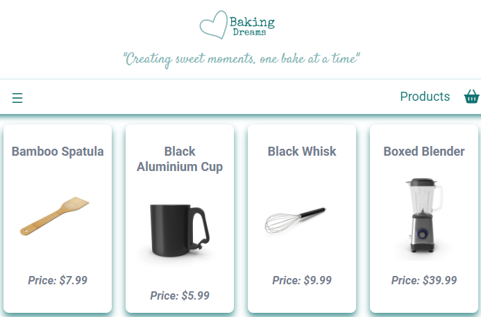
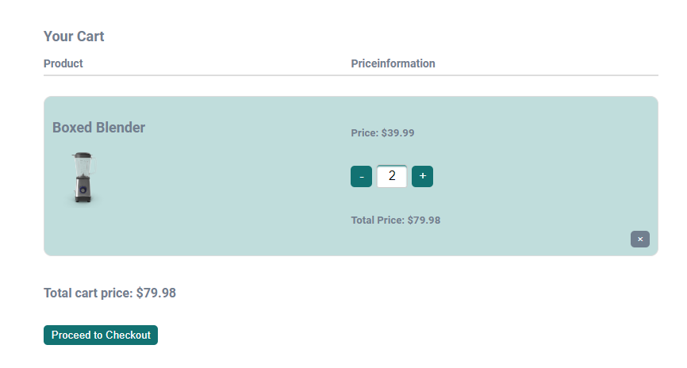
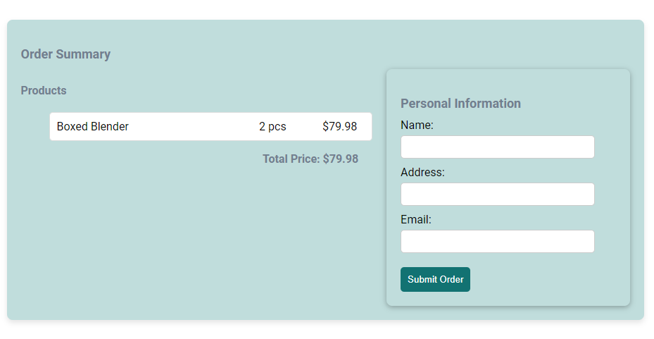

# Welcome to Alexandras-webshop Baking Dreams #

This project is a simple web-based e-commerce application for a kitchenaccessories shop, built with React as a schoolproject. Users may view a list of products, see details about individual products, add items to their cart, and proceed with an order. The application is structured with components for easy navigation and a responsive layout. 

## Table of Contents
- [Demo](#demo)
- [Features](#features)
- [Tech Stack](#tech-stack)
- [Installation](#installation)
- [Usage](#usage)
- [Components Overview](#components-overview)
- [Pages Overview](#pages-overview)
- [Available Scripts](#available-scripts)
- [Future Improvements](#future-improvements)
- [Contact](#contact)

---

## Demo
Demo of the project

### Screenshots
*ProductPage*



*CartPage*



*OrderSummary*



---

## Features
The project has following functions:
- Browse kitchenaccessories.
- View details about individual products.
- Add and remove products from the cart.
- View number of products in cart
- View a summary of the cart and total prices.
- Place an order.
- Get a notice when the order is placed
- Responsive design for different screen sizes (mobile, tablet, desktop).

---

## Tech Stack
- **React**: Frontend library.
- **React Router**: For navigation between different pages.
- **Axios**: For fetching product data from the API.
- **CSS**: For styling and responsive layout.

---

## Installation
Follow these steps to install the projekt:

1. Clone the repository:
   ```bash
   git clone https://github.com/CandyScull84/Alexandras-webshop.git

2. Navigate to the projects directory:
   ```bash
   cd alexandras-webshop

3. Install necessary dependencies and modules:
   ```bash
   npm install

4. Run the development server as soon as the installation is complete:
   ```bash
   npm start

The application should now be running on http://localhost:3000. Open this URL in your browser to view the app(If it not opens automatically)

---

## Usage
How to use the website:

### Viewing Products
- On the home page, there is a button to forward the user to all the products. The user may also be able to press Products in the navbar. When user press ether button/link a list of available products (kitchen accessories) will be displayed.
- Clicking on any product will take the user to the product's detailpage where more information can be found.

### Shopping Cart
- Products can be added to the cart from the product's detailpage.
- The shopping cart can be accessed from the navigation bar, where the user can view the items, update quantities, and remove products.
- Once ready, users can proceed to place an order, which currently clears the cart and simulates an order submission.

---

## Components Overview
Here you may find an overview of the main components in the project:

1. App.js
- Acts as the root component of the application.
- Defines routes for different pages like Home, Product, Productdetails, Cart, About, and Contact.
- Handles the global state for the shopping cart and manages actions like adding to cart, updating   cart, and removing items.

2. Header.js & Footer.js
- Display the header and footer across all pages.

3. Navbar.js
- Provides navigation link to products and access to the Cart.
- Displays the current number of items in the cart.

4. Sidebar.js
- Get access from hamburger-menu from left on smaller screens.
- Provides navigation links to home, products, about us and contact.

5. QuantityControl.js
- A component that increse and decrease the amount of products to add to or remove from cart.
- Includes an inputfield so the user can put in number of products themselves.

6. ScrollToTop.js
- Ensures the page scrolls to the top when navigating between routes.

---

## Pages Overview
Here you may find an overview of the pages in the project:

1. AboutPage.js
- Allows users to find information about the company through the about us link down in the footer or in sidebar on left side (on small screens).

2. ContactPage.js
- Allows users to find contactinformation to the company through the contact link down in the footer or in sidebar on left side (on small screens).

3. HomePage.js
- Display a Hero-picture with a button to explore the products on the site.

4. ProductPage.js
- Fetches and displays a list of products in a grid layout.
- Allows users to click on individual products to view more details.

5. ProductDetailPage.js
- Displays detailed information about a specific product.
- Allows users to add the product to the cart.

6. CartPage.js
- Displays the items added to the cart.
- Allows users to update quantities or remove items.

7. OrderSummary.js
- Displays the summary of items in the cart and simulates the process of placing an order.
- The users fill in the form with there personal information.

8. CSS (components and pages)
- The layout and responsiveness are handled in the App.css and individual component .css-files to ensure a consistent design and mobile-friendly layout.

---

## Available Scripts
In the project directory, you can run:

### `npm start`
- Runs the app in the development mode.
- Open [http://localhost:3000](http://localhost:3000) to view it in your browser.
- The page reloads on file changes and shows lint errors in the console.

### `npm test`
- Launches the test runner in the interactive watch mode.
- More info: [running tests](https://facebook.github.io/create-react-app/docs/running-tests).

### `npm run build`
- Builds the app for production to the `build` folder.
- Optimizes the build for the best performance, with minified and hashed filenames.
- Your app is ready to be deployed!
- More info: [deployment](https://facebook.github.io/create-react-app/docs/deployment).

### `npm run eject`
- **Caution:** This is a one-way operation. Once you `eject`, you can't go back.
- Copies all build configurations (Webpack, Babel, ESLint) to your project for full control.
- Use only if you need to customize the build setup beyond what Create React App provides.
- This command will remove the single build dependency from your project.

### `npm run build` fails to minify
- See troubleshooting guide: [Troubleshooting Build Errors](https://facebook.github.io/create-react-app/docs/troubleshooting#npm-run-build-fails-to-minify).

---

## Future-improvements
- Implement a backend for user authentication and order processing.
- Add a search and filter functionality to the product listing page.
- Integrate with a real payment gateway for completing orders.
- Add user reviews and ratings for products.
- Add more products

---

## Contact
- If you have any questions, feel free to reach out to CandyScull84.
